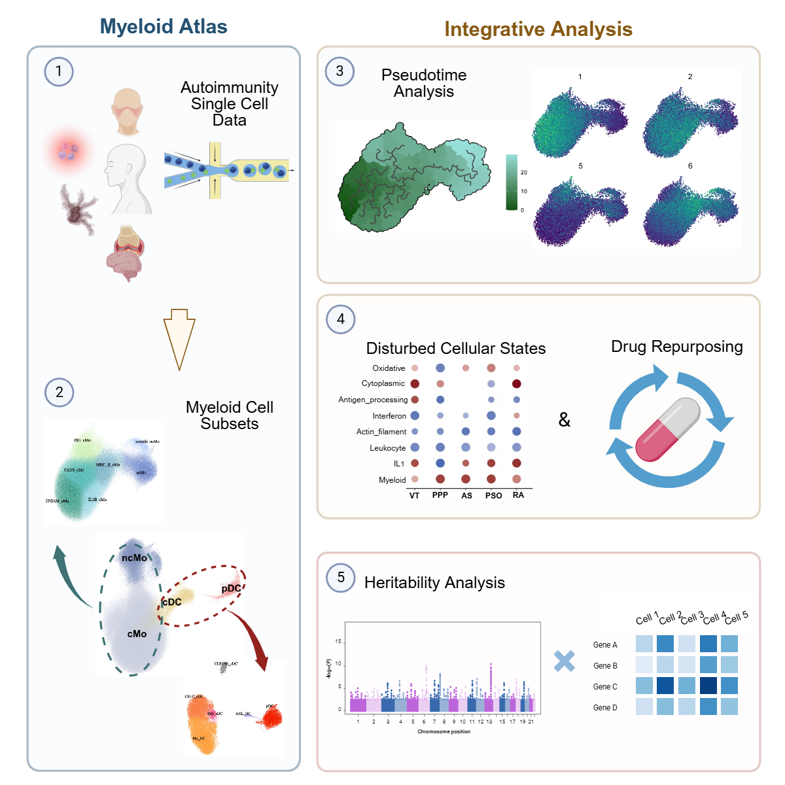

# Peripheral Myeloid cells in autoimmunity conditons

Myeloid cells are pivotal in autoimmune disorder development due to their varied immune response functions yet understanding them at the single-cell level in such conditions is limited. To address this gap, we analyzed 351,905 myeloid cells from 375 single-cell RNA sequencing samples covering 14 autoimmune diseases, which allowed us to classify myeloid cells into 13 distinct subsets with unique immunological profiles. Through pseudotime analysis, we identified a branching process leading to two intermediary inflammatory subtypes and observed dysregulation in eight co-expression modules crucial for monocyte function across autoimmune conditions. Notably, a module linked to myeloid cell activation was consistently upregulated in autoimmune disorders. This insight led us to identify potential drug targets for therapeutic repurposing within the dysregulated modules. By incorporating genetic data from genome-wide association studies, we identified 13 myeloid cell subsets predisposed to varying degrees of risk in different autoimmune conditions.

